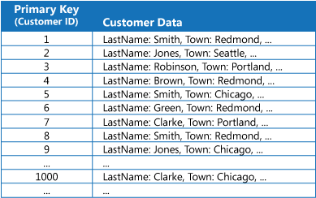
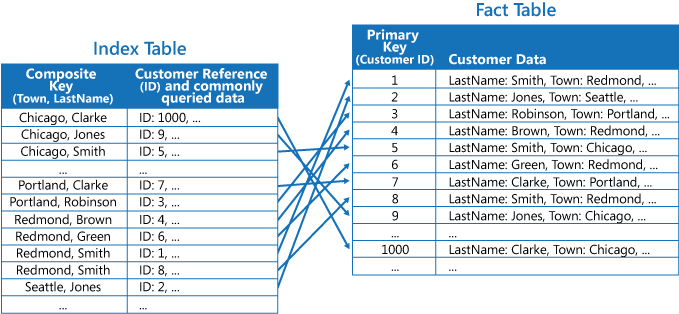
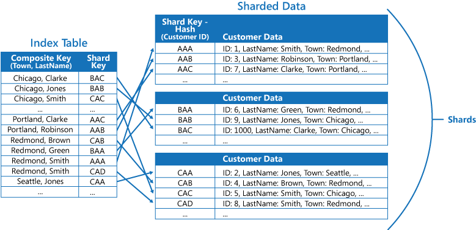
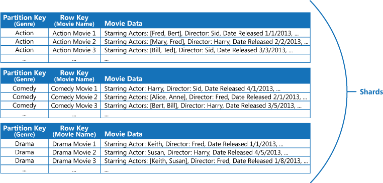
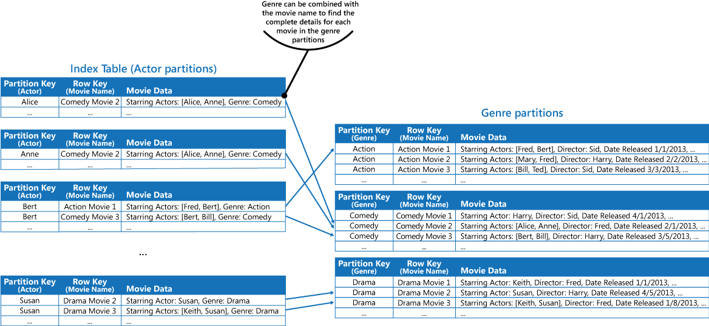

   
# Index Table

Create indexes over the fields in data stores that are frequently referenced by query criteria. This pattern can improve query performance by allowing applications to more quickly locate the data to retrieve from a data store.

## Context and problem

Many data stores organize the data for a collection of entities by using the primary key. An application can use this key to locate and retrieve data. Figure 1 shows an example of a data store holding customer information. The primary key is the Customer ID.

 

_Figure 1: Customer information organized by the primary key (Customer ID)_

While the primary key is valuable for queries that fetch data based on the value of this key, an application might not be able to use the primary key if it needs to retrieve data based on some other field. In the Customers example, an application can't use the Customer ID primary key to retrieve customers if it queries data solely by referencing the value of some other attribute, such as the town in which the customer is located. To perform a query such as this, the application might have to fetch and examine every customer record, which could be a slow process.

Many relational database management systems support secondary indexes. A secondary index is a separate data structure that's organized by one or more non-primary (secondary) key fields, and it indicates where the data for each indexed value is stored. The items in a secondary index are typically sorted by the value of the secondary keys to enable fast lookup of data. These indexes are usually maintained automatically by the database management system. 

You can create as many secondary indexes as are required to support the different queries that your application performs. For example, in a Customers table in a relational database where the customer ID is the primary key, it's beneficial to add a secondary index over the town field if the application frequently looks up customers by the town in which they reside.

However, although secondary indexes are common in relational systems, most NoSQL data stores used by cloud applications don't provide an equivalent feature.

## Solution

If the data store doesn't support secondary indexes, you can emulate them manually by creating your own index tables. An index table organizes the data by a specified key. Three strategies are commonly used for structuring an index table, depending on the number of secondary indexes that are required and the nature of the queries that an application performs.

The first strategy is to duplicate the data in each index table but organize it by different keys (complete denormalization). Figure 2 shows index tables that organize the same customer information by Town and LastName:

 
   
_Figure 2: Data is duplicated in each index table_

This strategy is appropriate if the data is relatively static compared to the number of times it's queried by using each key. If the data is more dynamic, the processing overhead of maintaining each index table becomes too large for this approach to be useful. Also, if the volume of data is very large, the amount of space required to store the duplicate data is significant.

The second strategy is to create normalized index tables organized by different keys and reference the original data by using the primary key rather than duplicating it, as shown in Figure 3. The original data is called a fact table:

 

_Figure 3: Data is referenced by each index table_

This technique saves space and reduces the overhead of maintaining duplicate data. The disadvantage is that an application has to perform two lookup operations to find data by using a secondary key. It has to find the primary key for the data in the index table, and then use the primary key to look up the data in the fact table.

The third strategy is to create partially normalized index tables organized by different keys that duplicate frequently retrieved fields. Reference the original data to access less frequently accessed fields. Figure 4 shows this.

_Figure 4: Commonly accessed data is duplicated in each index table_

With this strategy, you can strike a balance between the first two approaches. The data for common queries can be retrieved quickly by using a single lookup, while the space and maintenance overhead isn't as significant as duplicating the entire data set.

If an application frequently queries data by specifying a combination of values (for example, “Find all customers that live in Redmond and that have a last name of Smith”), you could implement the keys to the items in the index table as a concatenation of the Town attribute and the LastName attribute, as shown in Figure 5. The keys are sorted by Town, and then by LastName for records that have the same value for Town. 

_Figure 5: An index table based on composite keys_

Index tables can speed up query operations over sharded data, and are especially useful where the shard key is hashed. Figure 6 shows an example where the shard key is a hash of the Customer ID. The index table can organize data by the non-hashed value (Town and LastName), and provide the hashed shard key as the lookup data. This can save the application from repeatedly calculating hash keys, which is an expensive operation, if it needs to retrieve data that falls within a range, or it needs to fetch data in order of the non-hashed key. For example, a query such as “Find all customers that live in Redmond” can be quickly resolved by locating the matching items in the index table, where they're all stored in a contiguous block. Then, follow the references to the customer data by using the shard keys stored in the index table.

_Figure 6: An index table providing quick look up for sharded data_

## Issues and considerations

Consider the following points when deciding how to implement this pattern:

- The overhead of maintaining secondary indexes can be significant. You must analyze and understand the queries that your application uses. Only create index tables when they're likely to be used regularly. Don't create speculative index tables to support queries that an application doesn't perform, or performs only occasionally.
- Duplicating data in an index table can add significant overhead in storage costs and the effort required to maintain multiple copies of data.
- Implementing an index table as a normalized structure that references the original data requires an application to perform two lookup operations to find data. The first operation searches the index table to retrieve the primary key, and the second uses the primary key to fetch the data. 
- If a system incorporates a number of index tables over very large data sets, it can be difficult to maintain consistency between index tables and the original data. It might be possible to design the application around the eventual consistency model. For example, to insert, update, or delete data, an application could post a message to a queue and let a separate task perform the operation and maintain the index tables that reference this data asynchronously. For more information about implementing eventual consistency, see the [Data Consistency Primer](https://msdn.microsoft.com/library/dn589800.aspx).

   >  Microsoft Azure storage tables support transactional updates for changes made to data held in the same partition (referred to as entity group transactions). If you can store the data for a fact table and one or more index tables in the same partition, you can use this feature to help ensure consistency. 

- Index tables might themselves be partitioned or sharded.

## When to use this pattern

Use this pattern to improve query performance when an application frequently needs to retrieve data by using a key other than the primary (or shard) key. 

This pattern might not be useful when:

- Data is volatile. An index table can become out-of-date very quickly, making it ineffective or making the overhead of maintaining the index table greater than any savings made by using it.
- A field selected as the secondary key for an index table is very non-discriminating and can only have a small set of values (for example, gender). 
- The balance of the data values for a field selected as the secondary key for an index table are highly skewed. For example, if 90% of the records contain the same value in a field, then creating and maintaining an index table to look up data based on this field might create more overhead than scanning sequentially through the data. However, if queries very frequently target values that lie in the remaining 10%, this index can be useful. You should understand the queries that your application is performing, and how frequently they're performed.

## Example

Azure storage tables provide a highly scalable key/value data store for applications running in the cloud. Applications store and retrieve data values by specifying a key. The data values can contain multiple fields, but the structure of a data item is opaque to table storage, which simply handles a data item as an array of bytes.

Azure storage tables also support sharding. The sharding key comprises two elements, a partition key and a row key. Items that have the same partition key are stored in the same partition (shard), and the items are stored in row key order within a shard. Table storage is optimized for performing range queries that fetch data falling within a contiguous range of row key values within a partition. If you're building cloud applications that store information in Azure tables, you should structure your data with this feature in mind. 

For example, consider an application that stores information about movies. The application frequently queries movies by genre (Action, Documentary, Historical, Comedy, Drama, and so on). You could create an Azure table with partitions for each genre by using the genre as the partition key, and specifying the movie name as the row key, as shown in Figure 7. 

_Figure 7: Movie data stored in an Azure table_

This approach is less effective if the application also needs to query movies by starring actor. In this case, you can create a separate Azure table that acts as an index table. The partition key is the actor and the row key is the movie name. The data for each actor will be stored in separate partitions. If a movie stars more than one actor, the same movie will occur in multiple partitions. 

You can duplicate the movie data in the values held by each partition by adopting the first approach described in the Solution section above. However, it's likely that each movie will be replicated several times (once for each actor), so it might be more efficient to partially denormalize the data to support the most common queries (such as the names of the other actors) and enable an application to retrieve any remaining details by including the partition key necessary to find the complete information in the genre partitions. This approach is described by the third option in the Solution section. Figure 8 depicts this approach. 

_Figure 8: Actor partitions acting as index tables for movie data_

## Related patterns and guidance

The following patterns and guidance might also be relevant when implementing this pattern:

- [Data Consistency Primer](https://msdn.microsoft.com/library/dn589800.aspx). An index table must be maintained as the data that it indexes changes. In the cloud, it might not be possible or appropriate to perform operations that update an index as part of the same transaction that modifies the data. In that case, an eventually consistent approach is more suitable. This primer provides information on the issues surrounding eventual consistency. 
- [Sharding pattern](https://msdn.microsoft.com/library/dn589797.aspx). The Index Table pattern is frequently used in conjunction with data partitioned by using shards. The Sharding pattern provides more information on how to divide a data store into a set of shards.
- [Materialized View pattern](materialized-view.md). Instead of indexing data to support queries that summarize data, it might be more appropriate to create a materialized view of the data. This pattern describes how to support efficient summary queries by generating pre-populated views over data. 
